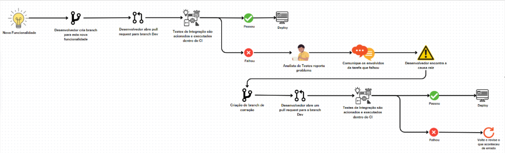

## Tecsus
### 5° Semestre • 2024-1
<p>Parceiro Acadêmico: <a href="https://tecsus.com.br/">Tecsus</a></p>
<p align = "center"></p>

<p>O projeto visa o desenvolvimento de uma aplicação web destinada à análise de consumo de contas de água, luz e gás dos clientes da empresa Tecsus. O principal objetivo da plataforma é fornecer aos funcionários da empresa insights valiosos sobre o comportamento dos consumidores, ajudando-os a identificar ações que possam melhorar a satisfação dos clientes com os serviços prestados. Além disso, a aplicação oferece suporte à tomada de decisões estratégicas, por meio de dashboards interativos e visualizações de dados, que apresentam informações detalhadas sobre os clientes e suas assinaturas de serviços de água, luz e gás. Dessa forma, a solução não só facilita o acompanhamento do consumo, mas também permite que a empresa otimize sua operação, fornecendo um panorama claro para a implementação de melhorias contínuas nos serviços.</p>

## Tecnologias Utilizadas

* __Java:__ Linguagem de programação backend;
* __JavaScript:__ Linguagem de programação backend e frontend;
* __Vue:__ Framework, da linguagem JavaScript, progressivo para construção de interfaces de usuário, que facilita a criação de aplicações web interativas e dinâmicas com uma abordagem reativa;
* __HTML:__ É a linguagem de marcação padrão usada para estruturar e apresentar conteúdo na web;
* __CSS:__ Liguagem de estilização da aplicação web;
* __Oracle:__ Sistema Gerenciador de Banco de Dados utilizado para armazenar as informações da aplicação web.
<br><br>

## Contribuições Pessoais
### Configuração da ferramenta Cypress
<p>Para garantir a estabilidade da aplicação durante o processo de integração contínua (CI), foi adotada uma ferramenta especializada em testes de ponta a ponta (E2E). Com essa ferramenta, foram criados casos de teste de integração que verificam o funcionamento completo do sistema sempre que um pull request é enviado para a branch dev. Esses testes permitem assegurar que nenhuma funcionalidade essencial foi comprometida, promovendo uma maior confiança nas alterações realizadas e facilitando a identificação de problemas antes da implementação em produção.</p>
<details>
<summary><h4>Mais detalhes</h4></summary>
<p>Cypress é um framework de teste da linguagem JavaScript. Tem como função construir e executar testes fim a fim, se baseando na navegação do usuário no sistema. Para configurar a ferramenta, foi necessário acessar o repositório do front-end em uma IDE de desenvolvimento e inserir o comando npm install cypress --save-dev. Após executar esse comando, a instalação do Cypress foi iniciada, sendo possível começar a criação de testes automatizados para a aplicação. A organização das pastas de testes já é configurada automaticamente pelo próprio Cypress, facilitando a estruturação do projeto. Por padrão, o arquivo de testes de integração do Cypress está localizado no diretório cypress/e2e/1-getting-started. O arquivo de exemplo que o Cypress gera inicialmente chama-se todo.cy.js, mas é possível criar novos arquivos de testes com nomes diferentes. </p>

<p>Abaixo é exemplificado o processo de configuração da ferramenta Cypress:</p>

<p align = "center"></p>
  
</details>
<br>

### Análise Estática
<p>A Análise Estática é o processo de examinar o código-fonte de um programa sem executá-lo, com o objetivo de identificar erros, vulnerabilidades e melhorar a qualidade do software. Ela utiliza ferramentas automatizadas que analisam o código em busca de problemas como violações de padrões, inconsistências, problemas de segurança e possíveis falhas de desempenho. Esse tipo de análise é muito útil para encontrar problemas precocemente no ciclo de desenvolvimento, promovendo um código mais seguro, eficiente e fácil de manter.</p>
<details>
<summary><h4>Mais detalhes</h4></summary>
<p>Para a análise estática do projeto, utilizou-se a ferramenta SonarCloud, uma solução baseada em nuvem que avalia a qualidade do código ao identificar bugs, vulnerabilidades e problemas de manutenção. Essa ferramenta auxilia na promoção de práticas de codificação mais seguras e eficientes. Foi necessário configurar o repositório para permitir que o SonarCloud realizasse as análises automaticamente. Sempre que uma pull request é criada, o SonarCloud é acionado, executando a análise estática e exibindo os resultados diretamente ao usuário, facilitando a detecção e correção de problemas antes da integração do código. </p>

<p>Abaixo é exemplificado a aplicação SonnarCloud:</p>


</details>
<br>

### Criação do fluxo de testes de integração
<p>Para validar o processo de DevOps, a equipe do projeto elaborou um fluxo detalhado que descreve o funcionamento do sistema. Entre as etapas definidas, destaca-se a realização dos testes de integração, essenciais para garantir que os diferentes módulos do projeto funcionem de forma conjunta e harmoniosa.</p>
<details>
<summary><h4>Mais detalhes</h4></summary>
<p>A realização de testes de integração é uma etapa fundamental no processo do projeto, pois permite identificar, de forma antecipada, possíveis problemas que podem surgir ao mesclar as branches na branch de desenvolvimento (Dev). Isso garante maior estabilidade e qualidade no código integrado, reduzindo erros antes das próximas etapas. Tudo começa com a ideia de uma nova funcionalidade, seguida pela criação de uma branch específica para seu desenvolvimento. Após a implementação, o desenvolvedor abre um pull request para integrar as alterações à branch principal de desenvolvimento (Dev), momento em que os testes de integração são acionados automaticamente.</p> 
<p></p>Se os testes forem bem-sucedidos, o código é aprovado e segue para o deploy. Caso contrário, os problemas identificados são reportados por um analista de testes, e os responsáveis pela tarefa são notificados para encontrar e corrigir a causa raiz do erro. Após os ajustes, uma nova branch de correção é criada, e as alterações passam novamente pelo pipeline de testes. Esse ciclo se repete até que todos os problemas sejam resolvidos, garantindo que apenas código validado seja enviado para produção.</p>

<p>Abaixo é mostrado o fluxo dos Testes de Integração:</p>

<p align = "center"></p>

</details>
<br>

### Criação de caso de teste de integração
<p>Com a configuração da ferramenta Cypress concluída, já é possível criar casos de testes de integração. Esses testes serão acionados automaticamente sempre que um desenvolvedor abrir um pull request para a branch principal de desenvolvimento (Dev), garantindo a validação contínua do código integrado.</p>
<details>
<summary><h4>Mais detalhes</h4></summary>
<p>O Cypress cria automaticamente um arquivo chamado "todo.cy.js", que serve como ponto de partida para o desenvolvimento de casos de testes de integração. No caso de teste criado, o código realiza um teste automatizado simulando o processo de cadastro de dados a partir de um arquivo CSV. O teste começa acessando a página do formulário, selecionando opções em dois campos ComboBox e realizando o upload de um arquivo CSV válido. Em seguida, o teste aguarda o processamento do arquivo e verifica se a mensagem da tabela desaparece. Por fim, o código simula um clique no botão para enviar o formulário, completando o fluxo de cadastro. </p>

<p>Abaixo é mostrado um caso de teste de integração (Teste de Cadastro):</p>

``` javascript
describe('Teste de cadastro com Cypress', () => {
  it('Deve selecionar campos, importar CSV e cadastrar no banco de dados', () => {
    // Visita a página onde está o formulário
    cy.visit('http://localhost:8080/upload');
    // Seleciona o primeiro campo ComboBox
    cy.get('#conta').select('Conta de energia');
    // Seleciona o segundo campo ComboBox
    cy.get('#documento').select('Contrato');
    // cy.get('#csv').input('teste_lucas.csv')
     // Upload a valid CSV file
     cy.get('#csv')
     .attachFile('teste_lucas.csv'); // Replace with the path to your valid CSV file
    // Wait for the file to be processed (adjust timeout if needed)
    cy.wait(5000);
    // Verify table data
    cy.get('.container-table-message').should('not.exist'); // Table message shouldn't be visible 
   
    cy.get('#botao').click();
    const fileContent = cy.get('#csv')
    .attachFile('teste_lucas.csv');
  });
```

</details>
<br>

<hr></hr>
<br><br>

## Aprendizados
<p>Durante o projeto, tive a oportunidade de aprimorar técnicas relacionadas a testes de software, além de aprender a criar fluxos de processos para o desenvolvimento de software. Também desenvolvi habilidades na utilização da ferramenta Cypress, criando casos de testes de integração para garantir a qualidade e a confiabilidade do sistema.</p>

<h3 align = "center">Hard Skills</h3>

<table align="center">
    <tr>
      <th width="300px">Tecnologia/Metodologia</th>
      <th width="300px">Classificação</th>
    </tr>
    <tr>
      <td>Cypress</td>
      <td>Sei fazer com Ajuda</td>
    </tr>
    <tr>
      <td>SonarCloud</td>
      <td>Sei fazer com Ajuda</td>
    </tr>
    <tr>
      <td>Documentação de Testes de Integração</td>
      <td>Sei fazer com Autonomia</td>
    </tr>
    <tr>
      <td>Criação de Fluxos de Processos</td>
      <td>Sei fazer com Autonomia</td>
    </tr>
</table>

<h3 align = "center">Soft Skills</h3>

<table align="center">
    <tr>
      <th width="300px">Habilidade</th>
      <th width="300px">Descrição</th>
    </tr>
    <tr>
      <td>Aprendizagem Contínua</td>
      <td>Precisei aprender tecnologias novas para aplicar no projeto</td>
    </tr>
    <tr>
      <td>Organização</td>
      <td>Precisei organizar como os testes de integração seriam executados, por meio de fluxos</td>
    </tr>
    <tr>
      <td>Inteligência Emocional</td>
      <td>Precisei controlar as emoções e focar na entrega de resultado</td>
    </tr>
    <tr>
      <td>Comunicação</td>
      <td>Precisei me comunicar constantemente com os demais membros da equipe para que o fluxo do DevOps continuasse funcional</td>
    </tr>
</table>

<hr></hr>
<br>

## Outros projetos:

#### 1° Semestre: <a href="https://github.com/lucasetdasilva/PortifolioBancodeDados/blob/main/1Semestre/1Semestre.md">Mó Viagem</a>
#### 2° Semestre: <a href="https://github.com/lucasetdasilva/PortifolioBancodeDados/blob/main/2Semestre/2Semestre.md">PRO4Jobs</a>
#### 3° Semestre: <a href="https://github.com/lucasetdasilva/PortifolioBancodeDados/blob/main/3Semestre/3Semestre.md">Sistema Gerenciador de Vendas</a>
#### 4° Semestre: <a href="https://github.com/lucasetdasilva/PortifolioBancodeDados/blob/main/4Semestre/4Semestre.md">Predial</a>
#### 6° Semestre: <a href="https://github.com/lucasetdasilva/PortifolioBancodeDados/blob/main/6Semestre/6Semestre.md">SPC Grafeno</a>
