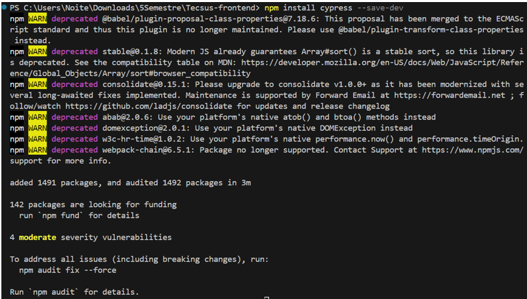

## Tecsus
### 5° Semestre • 2024-1

Parceiro Acadêmico: <a href="https://tecsus.com.br/">Tecsus</a>

O projeto visa o desenvolvimento de uma aplicação web destinada à análise de consumo de contas de água, luz e gás dos clientes da empresa Tecsus. O principal objetivo da plataforma é fornecer aos funcionários da empresa insights valiosos sobre o comportamento dos consumidores, ajudando-os a identificar ações que possam melhorar a satisfação dos clientes com os serviços prestados. Além disso, a aplicação oferece suporte à tomada de decisões estratégicas, por meio de dashboards interativos e visualizações de dados, que apresentam informações detalhadas sobre os clientes e suas assinaturas de serviços de água, luz e gás. Dessa forma, a solução não só facilita o acompanhamento do consumo, mas também permite que a empresa otimize sua operação, fornecendo um panorama claro para a implementação de melhorias contínuas nos serviços.

## Tecnologias Utilizadas

* __Java:__ Linguagem de programação backend;
* __JavaScript:__ Linguagem de programação backend e frontend;
* __Vue:__ Framework, da linguagem JavaScript, progressivo para construção de interfaces de usuário, que facilita a criação de aplicações web interativas e dinâmicas com uma abordagem reativa;
* __HTML:__ É a linguagem de marcação padrão usada para estruturar e apresentar conteúdo na web;
* __CSS:__ Liguagem de estilização da aplicação web;
* __Oracle:__ Sistema Gerenciador de Banco de Dados utilizado para armazenar as informações da aplicação web.
  

## Contribuições Pessoais
### Configuração da ferramenta Cypress

Para garantir a estabilidade da aplicação durante o processo de integração contínua (CI), foi adotada uma ferramenta especializada em testes de ponta a ponta (E2E). Com essa ferramenta, foram criados casos de teste de integração que verificam o funcionamento completo do sistema sempre que um pull request é enviado para a branch dev. Esses testes permitem assegurar que nenhuma funcionalidade essencial foi comprometida, promovendo uma maior confiança nas alterações realizadas e facilitando a identificação de problemas antes da implementação em produção.

<h4>Mais detalhes</h4>

Cypress é um framework de teste da linguagem JavaScript. Tem como função construir e executar testes fim a fim, se baseando na navegação do usuário no sistema. Para configurar a ferramenta, foi necessário acessar o repositório do front-end em uma IDE de desenvolvimento e inserir o comando npm install cypress --save-dev. Após executar esse comando, a instalação do Cypress foi iniciada, sendo possível começar a criação de testes automatizados para a aplicação. A organização das pastas de testes já é configurada automaticamente pelo próprio Cypress, facilitando a estruturação do projeto. Por padrão, o arquivo de testes de integração do Cypress está localizado no diretório cypress/e2e/1-getting-started. O arquivo de exemplo que o Cypress gera inicialmente chama-se todo.cy.js, mas é possível criar novos arquivos de testes com nomes diferentes. 

Abaixo é exemplificado o processo de configuração da ferramenta Cypress:

  

 

### Análise Estática

A Análise Estática é o processo de examinar o código-fonte de um programa sem executá-lo, com o objetivo de identificar erros, vulnerabilidades e melhorar a qualidade do software. Ela utiliza ferramentas automatizadas que analisam o código em busca de problemas como violações de padrões, inconsistências, problemas de segurança e possíveis falhas de desempenho. Esse tipo de análise é muito útil para encontrar problemas precocemente no ciclo de desenvolvimento, promovendo um código mais seguro, eficiente e fácil de manter.

<h4>Mais detalhes</h4>

Para a análise estática do projeto, utilizou-se a ferramenta SonarCloud, uma solução baseada em nuvem que avalia a qualidade do código ao identificar bugs, vulnerabilidades e problemas de manutenção. Essa ferramenta auxilia na promoção de práticas de codificação mais seguras e eficientes. Foi necessário configurar o repositório para permitir que o SonarCloud realizasse as análises automaticamente. Sempre que uma pull request é criada, o SonarCloud é acionado, executando a análise estática e exibindo os resultados diretamente ao usuário, facilitando a detecção e correção de problemas antes da integração do código. 

Abaixo é exemplificado a aplicação SonnarCloud:

 

### Criação do fluxo de testes de integração

Para validar o processo de DevOps, a equipe do projeto elaborou um fluxo detalhado que descreve o funcionamento do sistema. Entre as etapas definidas, destaca-se a realização dos testes de integração, essenciais para garantir que os diferentes módulos do projeto funcionem de forma conjunta e harmoniosa.

<h4>Mais detalhes</h4>

 

### Criação de caso de teste de integração

<h4>Mais detalhes</h4>

 

  

## Aprendizados

### - Hard Skills:

### - Soft Skills:

 

## Outros projetos:

#### 1° Semestre: <a href="https://github.com/lucasetdasilva/PortifolioBancodeDados/blob/main/1Semestre/1Semestre.md">Mó Viagem</a>
#### 2° Semestre: <a href="https://github.com/lucasetdasilva/PortifolioBancodeDados/blob/main/2Semestre/2Semestre.md">PRO4Jobs</a>
#### 3° Semestre: <a href="https://github.com/lucasetdasilva/PortifolioBancodeDados/blob/main/3Semestre/3Semestre.md">Sistema Gerenciador de Vendas</a>
#### 4° Semestre: <a href="https://github.com/lucasetdasilva/PortifolioBancodeDados/blob/main/4Semestre/4Semestre.md">Predial</a>
#### 6° Semestre: <a href="https://github.com/lucasetdasilva/PortifolioBancodeDados/blob/main/6Semestre/6Semestre.md">SPC Grafeno</a>
