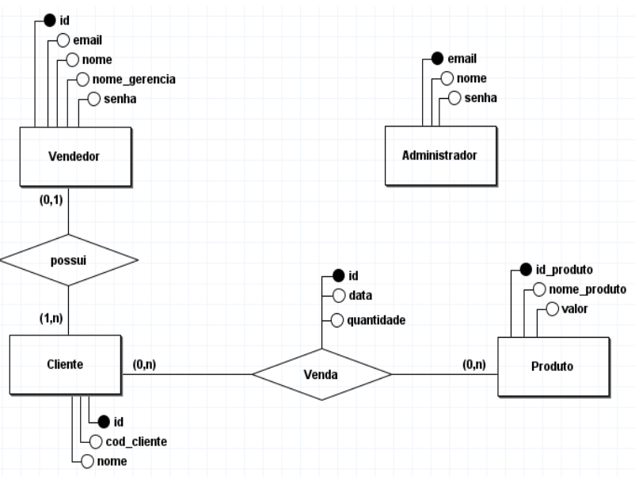

# Portifólio das API's - Lucas Emanoel
<p>O portfólio tem como objetivo documentar todos os API's (Aprendizagem por Projeto Integrado) para fins educacionais, além de servir como trabalho de graduação para a obtenção do diploma de tecnólogo em Banco de Dados proposto pela Faculdade de Tecnologia de São José dos Campos.</p>
<hr></hr>

## Sumário
[Sobre mim](#sobre-mim)

### Meus Projetos

#### 1° Semestre: <a href="https://github.com/lucasetdasilva/PortifolioBancodeDados/blob/main/1Semestre/1Semestre.md">Mó Viagem</a>
#### 2° Semestre: <a href="https://github.com/lucasetdasilva/PortifolioBancodeDados/blob/main/2Semestre/2Semestre.md">PRO4Jobs</a>
#### 3° Semestre: <a href="https://github.com/lucasetdasilva/PortifolioBancodeDados/blob/main/3Semestre/3Semestre.md">Sistema Gerenciador de Vendas</a>
#### 4° Semestre: [Predial](#predial)
#### 5° Semestre: [Tecsus](#tecsus)
#### 6° Semestre: [SPC Grafeno](#spc-grafeno)

<hr></hr>

## Sobre mim
<p align="center"></p>

<p>Me chamo Lucas Emanoel Teixeira Engracio da Silva, tenho 20 anos. Sou técnico em Desenvolvimento de Sistemas pela Etec Profa.
Ilza Nascimento Pintus - SJC e atualmente estou matriculado no 6° Semestre do curso tecnólogo em Banco de Dados na FATEC de 
São José dos Campos.</p>

<p>Possuo um grande conhecimento na área da tecnologia da informação, já tendo aprendido a construir softwares desktop, aplicações mobile, sistemas embarcados e aplicações web. Porém a minha maior paixão é na área de dados, construindo, manipulando e gerenciando um banco de dados.</p>

<p>Atualmente sou Analista de Testes na empresa Saipher ATC, que tem como ramo de atuação a construção de softwares para auxiliar no trabalho do trafégo aéreo dos aeródromos brasileiros.</p> 

<p align="center"> • <a href="https://www.linkedin.com/in/lucas-emanoel-teixeira-engracio-da-silva-ab5611234/">Linkedin</a> • <a href="https://github.com/lucasetdasilva">Github</a> • </p>

<br>
<hr></hr>

### Sistema Gerenciador de Vendas

##### 3° Semestre • 2023-1

<p>Parceiro Acadêmico: <a href="https://fatecsjc-prd.azurewebsites.net/">Dom Rock</a></p>
<br>

<br><br>

<p>O Sistema Gerenciador de Vendas é uma aplicação web voltada para o armazenamento e gerenciamento de vendas realizadas por vendedores. O intuito da aplicação é coletar os dados das vendas e transformar em valor de negócio por meio da geração de insights (gráficos), com isso deixando mais fácil de entender o que realmente está acontecendo com os dados.</p>
<p>O sistema também dispõe de um algoritmo que prevê quanto um vendedor precisa vender com base na quantidade planejada de vendas e o que realmente foi realizado.</p>

## Tecnologias Utilizadas

* __JavaScript:__ Linguagem de programação frontend;
* __React:__ Framework do JavaScript;
* __Java:__ Linguagem de programação backend;
* __SpringBoot:__ Framework do Java para o mapeamento de tabelas do banco de dados;
* __MySQL:__ SGBD utilizado para o armazenamento de dados;
* __TypeScript:__ Framework do JavaScript; 
* __Tailwind CSS:__ Linguagem de estilização da aplicação web.
<br><br>  

## Contribuições Pessoais

### Mapeamento de Tabelas
<p>Para que a linguagem de programação Java possa interpretar as informações armazenadas dentro de um Banco de Dados foi necessário realizar o mapeamento das tabelas da aplicação.</p>

<details>
<summary><h4>Mais detalhes</h4></summary>
<p> O mapeamento de tabelas é um conceito em que associamos classes Java a tabelas de um banco de dados relacional. O mesmo tem como objetivo trazer visibilidade dos dados armazenados dentro do banco de dados para o usuário final da aplicação, com o intuito de realizar consultas, atualizações, criações ou deleções (CRUD). O mapeamento utiliza uma especificação do Java chamada JPA(Java Persistence API) que tem como função persistir os dados na aplicação, para utilizá-la precisamos criar anotações. A linguagem back-end Java transforma tabelas em classes por meio da anotação "@entity" e "@Table(name = "nome_da_tabela_no_banco_de_dados")". </p>
 <p>Para transformar colunas do banco de dados em atributos do Java, precisamos utilizar a anotação "@Column(name = "nome_da_coluna_no_banco_de_dados)", também podemos utilizar a anotação "@Id" que serve para declarar a chave primária de uma tabela. Outra anotação muito importante é a "@GeneratedValue(strategy = GenerationType.IDENTITY)", ela deve ser utilizada quando a chave primária é auto incrementada, ou seja, quando criamos um registro a chave primária é preenchida automaticamente.</p>
 
<p>Abaixo é mostrado um exemplo de mapameamento da tabela de Produto:</p>

 ```java
package com.main.api.model;

import java.util.List;

import com.fasterxml.jackson.annotation.JsonIgnoreProperties;

import jakarta.persistence.Column;
import jakarta.persistence.Entity;
import jakarta.persistence.GeneratedValue;
import jakarta.persistence.GenerationType;
import jakarta.persistence.Id;
import jakarta.persistence.OneToMany;
import jakarta.persistence.Table;
import lombok.Getter;
import lombok.Setter;
@JsonIgnoreProperties({"hibernateLazyInitializer", "handler"})
@Entity
@Getter
@Setter
@Table(name = "produto")
public class Produto {
	
	@Id
	@GeneratedValue(strategy = GenerationType.IDENTITY)
	@Column(name= "id")
	private Long id;
	
	@Column(name = "nome")
	private String nome;
	
	@Column(name = "valor")
	private double valor;
	
	@OneToMany(mappedBy = "fk_sku_venda")
	private List<Venda> vendas;
	
}
```
</details>
<br>

### Criação de rotas REST
<p>A arquitetura REST é um estilo arquitetural que fornece diretrizes para o design e interação de sistemas distribuídos na web.</p>

<details>
<summary><h4>Mais detalhes</h4></summary>
<p>Em uma arquitetura REST, os recursos, que podem ser objetos, serviços ou conceitos, são identificados por URIs (Uniform Resource Identifiers). As operações sobre esses recursos são realizadas por meio dos métodos HTTP padrão, como GET para recuperar informações, POST para criar novos recursos, PUT para atualizar recursos existentes e DELETE para removê-los.</p>
<p>A arquiteura REST foi de extrema importância no projeto, pois com ela podemos fazer a conexão entre o back-end e o front-end da aplicação web. Em outras palavras, significa que o back-end puxa as informações do banco de dados, processa as informações e em seguida transfere essas informações para o front-end, onde o usuário da aplicação pode executar ações que podem modificar, criar, deletar ou apenas visualizar estes dados, respeitando o privilégio de cada usuário no sistema.</p>

<p> Abaixo é mostrado um exemplo de uma rota REST que mostra todos os produtos:</p>

 ```java
@GetMapping("/list")
	public List<Produto> findAll() {
		return produtoRepository.findAll();
	}
```
</details>
<br>

### Modelagem do Banco de Dados
<p>Todo sistema por mais simples que aparenta ser, necessita de um banco de dados para que as informações relevantes que percorrem a aplicação não sejam perdidas.</p>

<details>
 <summary><h4>Mais detalhes</h4></summary>
<p> A primeira etapa que precisei realizar foi o Modelo de Entidade Reacional, ou DER, que tem como objetivo mostrar como deve ser o fluxo de dados dentro do banco de dados. Foi necessário fazer um levantamento de entidades, atributos e quais entidades possuem relacionamentos, levando em consideração o contexto do projeto. Depois de levantar esses quesitos é necessário estudar a cardinalidade entre as entidades, pois com base nela surgirão chaves estrangeiras e tabelas de relação no Modelo de Entidade Relacional.
</p>
<p>Após a finalição do DER se faz necessário a criação do Modelo de Entidade Relacional, ou MER, que tem como objetivo criar tabelas e seus relacionamentos como base no modelo conceitual feito anteriormente. Sendo assim, as entidades se tornam tabelas e os atributos viram campos. Com base na cardinalidade das tabelas é necessário criar novas tabelas e criar chaves estrangeiras, isso ajuda o banco a manter sua consistência e diminuir redundâncias.
</p> 
<br>
 
<p>Abaixo é mostrado o Diagrama de Entidade Relacional da aplicação:</p>
<br>
<p align="center"> </p>
</details>
<br>

### Atualização Planejamento de Vendas

<p>Quando um vendedor acessa a aplicação, uma das funções que ele pode realizar é o planejamento de suas vendas. Essa função se faz necessária para o entendimento das vendas de um determinado vendedor, pois o mesmo poderá compreender se está lucrando mais ou menos durante um determinado período de tempo. </p>

<details>
<summary><h4>Mais detalhes</h4></summary>
<p>Uma das principais responsabilidades que um vendedor tem durante sua jornada na aplicação é o planejamento de vendas. Na aplicação um vendedor pode cadastrar um planejamento de suas vendas, ou seja, quanto ele acha que irá vender em um período de três meses para frente. Para realizar o cadastro é preciso ter mapeado as tabelas relacionadas as vendas, depois disso é necessário a construção da classe Controller (rotas REST) e a interface Repository (Queries). Na classe Controller deve ser criado um método de cadastro do planejamento de vendas. Por meio da URL passada pelo método é possível obter as informações e gravá-las dentro do banco de dados. Para que isso se concretize é necessário também utilizar a anotação "@PostMapping" responsável por cadastrar objetos no banco de dados. </p>
<p>Para cada mês que passar o vendedor terá que atualizar o planejamento, adicionando o que realmente foi vendido em um determinado mês. Para isso deve ser criado na classe Controller um método de atualização, por meio da anotação "@PutMapping". Com o cadastro e a atualização do planejamento de vendas de um determinado vendedor, é gerado um dashboard em que é mostrado três linhas: um para o planejamento de vendas, um para o que realmente foi vendido e uma para a predição. Com este dashboard o vendedor poderá entender em qual situação ele se encontra e conseguirá tomar as melhores decisões para o seu negócio.</p>

<p>Abaixo é mostrado a implementação do método de atualização do planejamento de vendas:</p>

 ```java
@PutMapping("/update/{vendaId}")
	public ResponseEntity<String> atualizarVenda(@PathVariable Long vendaId,
			@RequestParam double first_real_qtd,
			@RequestParam double second_real_qtd,
			@RequestParam double third_real_qtd) {

		Optional<Venda> vendaOptional = vendaRepository.findById(vendaId);

		if (vendaOptional.isPresent()) {
			Venda vendaEncontrada = vendaOptional.get();
			vendaEncontrada.setFirst_real_qtd(first_real_qtd);
			vendaEncontrada.setSecond_real_qtd(second_real_qtd);
			vendaEncontrada.setThird_real_qtd(third_real_qtd);

			vendaRepository.save(vendaEncontrada);

			return ResponseEntity.ok("Venda atualizada com sucesso!");
		} else {
			return ResponseEntity.notFound().build();
		}
	}

```
</details>

<hr></hr>

## Aprendizados 

<p>Como Scrum Master da minha equipe pude entender como deve ser realizado a organização de uma equipe, sempre conversando com os demais membros para entender suas necessidades em relação ao desenvolvimento do projeto, ou seja, tive que observar se as tarefas estavam sendo realizadas como o esperado, se os membros da equipe estavam com impedimentos externos ou internos e como poderia amenizar a situação. Ser Scrum Master mostrou para mim que a comunicação é a chave para se construir confiança uns com os outros, pois o ponto que todos estão em sincronia o projeto e consequentemente o produto final teram uma qualidade superior ao esperado pelo cliente.</p>
<p>Como desenvolvedor pude aprimorar meus conhecimentos em modelagem de dados, além de estudar e aplicar os conhecimentos que adquiri com o framework SpringBoot, para o desenvolvimento do back-end da aplicação.</p> 

### - Hard Skills:
* Criação de rota REST (método PUT)
* Desenvolvimento Back-end utilizando o framework SpringBoot, pertencente a linguagem Java
* Modelagem de Banco de Dados

### - Soft Skills:
* Comunicação
* Organização
* Inteligência Emocional
<hr></hr>
<br>

### Predial
##### 4° Semestre • 2023-2
<p>Parceiro Acadêmico: <a href="https://www.jaia.software/">Jaia Software</a></p>
<p align = "center"></p>

<p>O projeto envolve desenvolver uma aplicação web voltada para o gerenciamento de inspeções prediais, onde o cliente faz um pedido de inspeção, e a empresa cria uma ordem de serviço com base nessa solicitação. Na plataforma, o inspetor poderá registrar de forma detalhada suas observações sobre o ambiente do cliente, gerando um documento final com essas informações. Além disso, o administrador terá a capacidade de criar checklists específicos para diferentes departamentos, além de gerenciar funcionários e departamentos, realizando operações como cadastro, exclusão, visualização e edição.</p>

## Tecnologias Utilizadas

* __Java:__ Linguagem de programação backend;
* __JavaScript:__ Linguagem de programação backend e frontend;
* __Vue:__ Framework, da linguagem JavaScript, progressivo para construção de interfaces de usuário, que facilita a criação de aplicações web interativas e dinâmicas com uma abordagem reativa;
* __HTML:__ É a linguagem de marcação padrão usada para estruturar e apresentar conteúdo na web;
* __CSS:__ Liguagem de estilização da aplicação web;
* __Oracle:__ Sistema Gerenciador de Banco de Dados utilizado para armazenar as informações da aplicação web.
<br><br>

## Contribuições Pessoais
### Cadastro de requisições dos clientes
<p>Quando um cliente deseja solicitar uma inspeção predial em seu ambiente corporativo, com foco no bem-estar dos colaboradores, ele pode utilizar a aplicação web para abrir uma nova requisição. Nessa etapa, o cliente especificará o que precisa ser inspecionado. Após o cadastro, a requisição é enviada à empresa responsável pela inspeção, que analisará os detalhes e, com base nisso, criará uma Ordem de Serviço (OS). </p>
<details>
<summary><h4>Mais detalhes</h4></summary>
<p>A requisição dos clientes aborda muitas camadas a serem desenvolvidas. Entre essas camadas se encontra o framework Vue (frontend), utilizado para a criação de 	interfaces de usuário. Para que este framework funcione de maneira correta, ele deve apresentar e exibir as informações que estão armazenadas no banco de dados ao 	usuário. Isso só é possível pois o Vue utiliza caminhos para se comunicar com o backend da aplicação, que consegue acessar o banco de dados e obter ou exibir os 	dados necessários na tela do usuário. Para a criação das requisições dos clientes, deve-se primeiro criar um formulário para o preenchimento das informações por 	parte do cliente. Feito isso, foi necessário criar variavéis no Vue para armazenar essas informações.</p> 
<p>Por último, foi criada uma função assícrona que obtém as informações de um determinado usuário, utilizando o método "get", em seguida foi realizado o método 	"post", para enviar o cadastro de requisição para o backend, que depois passará a informação ao banco de dados. Com base na resposta do método "get", foi possível 	obter o campo "Id" do cliente. Sem este campo não seria possível o cadastro da requisição, pois é necessário a informação de quem a solicitou, para que o 		administrador do sistema consiga criar a Ordem de Serviço.</p>
 <p>Abaixo é mostrado a transferência de dados de requisições do cliente do Vue para o Java:</p>

 ```javascript
  		async function createRequisition(){
  		  cliente.value = (await axios.get("http://localhost:8080/cliente/" + cnpjValue.value)).data;
                  await axios.post("http://localhost:8080/requisicao/"+ cliente.value.id,
                                    {
                                      nome:nameValue.value,
                                      inspecao:inspectionValue.value,
                                      descricao:describeValue.value,
                                      status:statusReqValue.value,
                                      data_abertura: dateValue.value
                                     }).then(response => {
                                       console.log(response)
                                     })
                }
```
</details>
<br>

### Atualização de funcionários
<p>Um método de atualização de dados de funcionários permite que administradores modifiquem informações desatualizadas ou incorretas, como nome e email. Esse método geralmente envolve a criação de um endpoint que recebe os dados atualizados e, a partir de uma consulta ao banco de dados, altera as informações do funcionário. Esse processo facilita a manutenção de dados precisos, garantindo que o sistema esteja sempre atualizado e ajudando na gestão eficiente dos colaboradores.</p>
<details>
<summary><h4>Mais detalhes</h4></summary>
<p>Para que seja realizada a alteração dos dados de um determinado cliente, é necessário encontrar o registro do mesmo e por fim realizar as alterações desejadas. A linguagem backend (Java) deve obter estas informações dentro do banco de dados. Quando uma solicitação de atualização vem para o sistema, por meio de um endpoint HTTP PUT para a URL "/atualizar/{cpf}", o método "atualizarFuncionario" é acionado. Ele recebe o CPF do funcionário na URL (@PathVariable) e os novos dados do funcionário no corpo da requisição (@RequestBody). O método chama o serviço "funcionarioService.atualizarFuncionario(cpf,novoFuncionario)" para processar e atualizar o funcionário. Se a atualização for bem-sucedida, o método retorna o objeto Funcionario atualizado com status 200 (OK). Caso o funcionário não seja encontrado, retorna status 404 (Not Found).</p>	

<p>Abaixo é mostrado o método de atualização de um funcionário:</p>
 
```java
@PutMapping("/atualizar/{cpf}")
    public ResponseEntity<Funcionario> atualizarFuncionario(
        @PathVariable Integer cpf, 
        @RequestBody Funcionario novoFuncionario
    ) {
        Funcionario funcionarioAtualizado = funcionarioService.atualizarFuncionario(cpf, novoFuncionario);
        
        if (funcionarioAtualizado != null) {
            return ResponseEntity.ok(funcionarioAtualizado);
        } else {
            return ResponseEntity.notFound().build();
        }
    }
```
 
</details>
<br>

### Listagem de funcionários
<p>Um método de visualização de dados de funcionários permite que administradores acessem informações atualizadas sobre os colaboradores, como nome e email. Geralmente, esse método envolve a criação de um endpoint que consulta o banco de dados e apresenta os dados de forma estruturada. Pode incluir filtros para facilitar a busca por informações específicas, ajudando na gestão eficiente dos funcionários e na tomada de decisões.</p>
<details>
<summary><h4>Mais detalhes</h4></summary>
<p>O endpoint mapeado pela anotação @GetMapping("/listarporcpf/{cpf}") expõe uma rota HTTP GET que recebe um parâmetro dinâmico, o CPF, diretamente na URL. O {cpf} é uma variável de caminho (path variable) que o Spring Boot automaticamente captura e passa como argumento para o método do controlador. No caso do projeto desenvolvido, a variável cpf é do tipo Integer.</p>
<p>O método buscarFuncionarioPorCpf chama o serviço funcionarioService.buscarPorCpf(cpf), que é responsável por buscar no banco de dados um funcionário cujo CPF corresponda ao valor passado. Se o funcionário for encontrado, o método retorna um ResponseEntity com status HTTP 200 (OK) e o objeto Funcionario no corpo da resposta. O Spring converte automaticamente esse objeto em formato JSON, que é o formato esperado em APIs RESTful.</p>

<p>Abaixo é mostrado o método de visualização de um funcionário:</p>
 
```java
@GetMapping("/listarporcpf/{cpf}")
    public ResponseEntity<Funcionario> buscarFuncionarioPorCpf(@PathVariable Integer cpf) {
        Funcionario funcionario = funcionarioService.buscarPorCpf(cpf);
        return ResponseEntity.ok(funcionario);
    }
```
</details>
<br>

### Deleção de funcionário
<p>A deleção de um funcionário é o processo de remover permanentemente os dados de um funcionário do sistema, geralmente a partir de um identificador único, como o CPF. Esse processo envolve a exclusão dos registros relacionados ao funcionário no banco de dados, tornando esses dados inacessíveis para futuras operações ou consultas.</p>
<details>
<summary><h4>Mais detalhes</h4></summary>
<p>O endpoint HTTP DELETE /deletar/{cpf} tem como objetivo permitir que o sistema exclua um funcionário utilizando o CPF como identificador único. Quando um cliente faz uma requisição DELETE para esse endpoint, o Spring Boot mapeia o CPF da URL para o método do controlador. O CPF é passado como parâmetro para o serviço funcionarioService, que contém a lógica de negócios para deletar o funcionário no banco de dados. Esse tipo de operação de deleção é crucial para manter a integridade e a precisão dos dados no sistema, especialmente em sistemas que precisam de manutenção contínua e atualizações regulares de registros. Além disso, deve-se tomar cuidado para garantir que apenas usuários autorizados, administradores, tenham permissão para realizar exclusões de dados, para evitar problemas de segurança.</p>

<p>Abaixo é mostrado um método de exclusão de um funcionário:</p>

```java
 @DeleteMapping("/deletar/{cpf}")
    public void deletarFuncionario(@PathVariable Integer cpf){
        funcionarioService.deletarFuncionario(cpf);
    }
```
</details>
<hr></hr>

## Aprendizados
<p>Como desenvolvedor pude continuar a aperfeiçoar meus conhecimentos em relação a modelagem e estruturação de bancos de dados, além de compreender melhor como funciona o mapeamento de tabelas, utilizando a linguagem Java. Também pude realizar a construção de casos de testes para verficar e validar se a aplicação estava se comportando de maneira esperada com base nos requisitos do sistema, assim garantindo a qualidade ao cliente. </p>

### - Hard Skills:
* Mapeamento de tabelas (Spring Boot)
* Modelagem de Banco de Dados
* Criação de rotas REST

### - Soft Skills:
* Planejamento
* Aprendizagem contínua
* Trabalho em equipe

<hr></hr>
<br>

### Tecsus
##### 5° Semestre • 2024-1
<p>Parceiro Acadêmico: <a href="https://tecsus.com.br/">Tecsus</a></p>
<p align = "center"></p>

<p>O projeto visa o desenvolvimento de uma aplicação web destinada à análise de consumo de contas de água, luz e gás dos clientes da empresa Tecsus. O principal objetivo da plataforma é fornecer aos funcionários da empresa insights valiosos sobre o comportamento dos consumidores, ajudando-os a identificar ações que possam melhorar a satisfação dos clientes com os serviços prestados. Além disso, a aplicação oferece suporte à tomada de decisões estratégicas, por meio de dashboards interativos e visualizações de dados, que apresentam informações detalhadas sobre os clientes e suas assinaturas de serviços de água, luz e gás. Dessa forma, a solução não só facilita o acompanhamento do consumo, mas também permite que a empresa otimize sua operação, fornecendo um panorama claro para a implementação de melhorias contínuas nos serviços.</p>

## Tecnologias Utilizadas

* __Java:__ Linguagem de programação backend;
* __JavaScript:__ Linguagem de programação backend e frontend;
* __Vue:__ Framework, da linguagem JavaScript, progressivo para construção de interfaces de usuário, que facilita a criação de aplicações web interativas e dinâmicas com uma abordagem reativa;
* __HTML:__ É a linguagem de marcação padrão usada para estruturar e apresentar conteúdo na web;
* __CSS:__ Liguagem de estilização da aplicação web;
* __Oracle:__ Sistema Gerenciador de Banco de Dados utilizado para armazenar as informações da aplicação web.
<br><br>

## Contribuições Pessoais
### Criação de caso de teste de integração
<p></p>
<details>
<summary><h4>Mais detalhes</h4></summary>
</details>
<br>


<hr></hr>

## Aprendizados

### - Hard Skills:

### - Soft Skills:

<hr></hr>
<br>

### SPC Grafeno
##### 6° Semestre • 2024-2
<p>Parceiro Acadêmico: <a href="https://spcgrafeno.com.br/">SPC Grafeno</a></p>
<p align = "center"></p>


